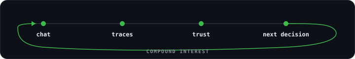

<!--
  Profile: heggria/heggria
  Rule: evidence first, philosophy second. Every number here must be checkable.
-->

<div align="center">

# Heggria

### I make agent runs verifiable, replayable, and incremental.

Agent infrastructure · [@minimax](https://github.com/minimax) · Beijing

[](https://www.npmjs.com/package/pi-taskflow)
[](https://www.npmjs.com/package/pi-taskflow)
[](https://github.com/heggria/taskflow/stargazers)
[](https://github.com/heggria/taskflow/tree/main/packages)

[`taskflow`](https://github.com/heggria/taskflow)
&nbsp;·&nbsp;
[`docs`](https://heggria.github.io/taskflow/)
&nbsp;·&nbsp;
[`writing`](https://heggria.github.io/writing/)
&nbsp;·&nbsp;
[`bilibili`](https://space.bilibili.com/20296120)
&nbsp;·&nbsp;
[`email`](mailto:bshengtao@gmail.com)

</div>

---

## A run that stopped before paying for the expensive part

Real output from a Pi run — not a mock dashboard:

```text
⊗ taskflow self-improve  6/7 · blocked · $0.095
    ✓ discover            agent   deepseek-v4-flash  10t ↑38k ↓6.7k $0.011
  ┌ ✓ write-runner-tests  agent   claude-sonnet-4-6  10t ↑13  ↓6.6k $0.020
  ├ ✓ write-store-tests   agent   claude-sonnet-4-6  10t ↑11  ↓10k  $0.018
  ├ ✓ write-agents-tests  agent   claude-sonnet-4-6  10t ↑28  ↓13k  $0.030
  └ ✓ fix-stability       agent   claude-sonnet-4-6  10t ↑13  ↓3.9k $0.012
    ✓ verify              gate    BLOCK 3 type errors in test files
    ⊘ report              reduce  skipped · Gate blocked  ↳ fix-stability
```

The layout **is** the DAG: parallel rails are concurrency, long edges are dependencies,
and the gate states why downstream work stopped. No separate control plane needed to read it.

Nine operations answer questions about a graph for **zero model calls** —
`plan` · `verify` · `compile` · `lint` · `ir` · `trace` · `replay` · `why-stale` · `analytics`.
You can price a run before spending on it, and re-ask what happened after it ends.

---

## Now building — [taskflow](https://github.com/heggria/taskflow)

**The compounding layer for multi-agent work.**
Declarative DAGs, statically verified, executed in isolated subagents,
resumable across sessions, replayable without tokens, recomputed from the smallest stale frontier.

| | |
|---|---|
| **Runs on** | Pi · Codex · Claude Code · OpenCode · Grok Build |
| **Surface** | 12 phase types · 18 built-in agents · 19 MCP tools · TypeScript DSL → portable JSON |
| **Compiled identity** | FlowIR + content hash → provenance, stale analysis, cross-run cache |
| **Proof** | 1,500+ tests · 9 published packages · MIT · CI on `main` + every PR |
| **Adoption** | ~3.3k npm installs / month |

```text
verify before spend  ·  replay without tokens  ·  recompute the stale frontier
```

[repo](https://github.com/heggria/taskflow) · [docs](https://heggria.github.io/taskflow/) · [examples](https://github.com/heggria/taskflow/tree/main/examples) · [changelog](https://github.com/heggria/taskflow/blob/main/CHANGELOG.md)

One project, gone deep. Everything below is smaller by design.

---

## What's next

Following me is a subscription, so here is what it buys.

| Status | What |
|---|---|
| 🚧 in progress | **taskflow 0.3.0 — Trusted Effects.** Declared side effects with confidentiality/integrity labels; filesystem writes promoted only through `snapshot → stage → verify → commit`. `whyAuthorized` / `whyEffect` explain any write after the fact. Branch: `feat/0.3.0-trusted-effects`. |
| 🚧 in progress | **Honest host baseline.** A published conformance matrix of what each of the five hosts actually supports — no capability claimed that isn't tested. |
| ⏭ next | **Write up incremental recompute for agent graphs** — what Bazel/Nix/Salsa get right, and what breaks when the "build steps" are nondeterministic. |

Watch [taskflow releases](https://github.com/heggria/taskflow/releases) for the shipping version of this list.

---

## Why I build it this way

<div align="center">

</div>

Getting something to run once is only principal. Real completion leaves interest:
a contract for what *done* meant, evidence of what actually happened, and an honest note
about where uncertainty remains. Chat is excellent at momentum, and momentum evaporates —
two weeks later, *why* the fifteenth revision happened is buried under the first fourteen.

So I put the compounding part in artifacts instead of transcripts:
**the interface that creates the work should not be the only place that can understand it.**

Two rulers I actually use when choosing:

```text
01  Evidence outlives confidence.
02  Constraints give a tool its character — omissions as deliberate as features.
```

More: [Work should outlive chat](https://heggria.github.io/writing/work-should-outlive-chat/) ·
[Trust comes from boundaries](https://heggria.github.io/writing/trust-comes-from-boundaries/) ·
[Small tools, sharp edges](https://heggria.github.io/writing/small-tools-sharp-edges/)

---

## Personal tools & labs

Things I built for myself. Listed because they're where the ideas got tested first — not as products, and not all of them public.

- **Hermit** *(private, personal daily driver)* — a governed local kernel for long-running work: permissions with shape, receipts for what happened, recovery after failure. It's how I found out which parts of "bounded authority" survive contact with my own impatience; taskflow's gates and effect model owe it a lot. Built for one user, so the source stays closed by choice — not a product, and not a stalled open-source plan.
- **[home-compass](https://github.com/heggria/home-compass)** — Beijing housing scorecards where "affordable on paper" ≠ "comfortable to live with."
- **[selffield](https://heggria.github.io/selffield/)** — a personal mirror grown from evidence and tension, with no personality labels.
- **cli-lab** *(private)* — local CLI experiments consolidated into one monorepo. The standalone snapshots in my repo list are the archived predecessors: kept for history, not maintained.

---

## About

I work at MiniMax in Beijing, between agent infrastructure and full-stack products.
Day languages: TypeScript · Python · Node.js · Vue — but the language I care about most is
the one between a system and the person trying to understand it.

Engineering is practice; writing is necessity. What I ship publicly, I back with evidence;
what I keep private, I say is private.

<div align="center">

<sub>
Follow if you work on agent orchestration, incremental computation, or making runs auditable.<br/>
<em>Once is not enough — make the next time cheaper.</em>
</sub>

</div>
